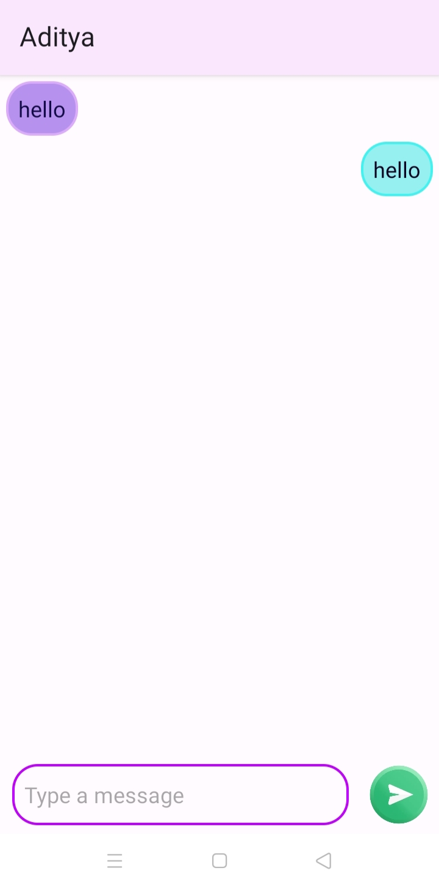

# QuikChat - Android App

## Overview

QuikChat is a feature-rich Android application designed to provide users with a seamless and interactive messaging experience. The app allows users to sign up, log in, and communicate with other users in real-time. Leveraging Firebase for backend integration, QuikChat ensures secure and reliable messaging services.

## Features

### 1. User Authentication

- **Signup:** New users can create an account by providing necessary details.
- **Login:** Existing users can securely log in to their accounts.

### 2. Real-time Messaging

QuikChat offers a robust real-time messaging system, allowing users to communicate instantly with each other through text messages. This feature includes:

#### a. Instant Message Delivery

- Messages are delivered to the recipient in real-time, providing a quick and responsive communication experience.

#### b. Message History

- The app maintains a comprehensive message history, allowing users to review past conversations seamlessly for every user (both sender and receiver).

### 3. User Interaction

- **View Other Users:** QuikChat enables users to see a list of other registered users.
- **Profile Information:** Users can view the profile information of other users.

### 4. Firebase Integration

- **Real-time Database:** QuikChat utilizes Firebase Realtime Database for storing and retrieving user data and messages.
- **Authentication:** Firebase Authentication ensures secure user authentication.

### 5. Logout

- **Logout:** Users can securely log out of their accounts.

## Screenshots

<table align="center">
  <tr>
    <td></td>
    <td></td>
  </tr>
  <tr>
    <td><em>Signup Page: User registration and signup.</em></td>
    <td><em>Login Page: User login and authentication.</em></td>
  </tr>
</table>

<table align="center">
  <tr>
    <td></td>
    <td></td>
  </tr>
  <tr>
    <td><em>Home Page: Main app interface with all users  and   a logout button on the top-right corner.</em></td>
    <td><em>User Chat: Real-time messaging interface with user.</em></td>
  </tr>
</table>

## Getting Started

### Prerequisites

- Android Studio installed.
- Firebase project created with necessary configurations.

### Installation

1. Clone the repository: `git clone https://github.com/shib1111111/QuikChat_Android_App.git`
2. Open the project in Android Studio.
3. Connect the app to your Firebase project by adding the necessary configuration files.
4. Build and run the app on an Android emulator or device.

## Downloading the App

For the primary release of QuikChat, you can download the APK file from the [Releases](https://github.com/shib1111111/QuikChat_Android_App/blob/master/app/release/) section. Follow these steps:

1. Visit the [Releases](https://github.com/shib1111111/QuikChat_Android_App/blob/master/app/release/app-release.apk) section of the GitHub repository.
2. Find the latest release and locate the APK file in the assets.
3. Download the APK file to your Android device.
   
## Usage

1. Launch the app.
2. Sign up or log in with your credentials.
3. Explore the list of users.
4. Start sending and receiving text messages in real-time.

## Contributing

We welcome contributions to enhance QuikChat. Feel free to open issues or submit pull requests.

## License

This project is licensed under the [MIT License](LICENSE).

## Acknowledgments

- Firebase for providing a robust backend infrastructure.
- Android developers' community for support and inspiration.

Thank you for using QuikChat! Feel free to reach out with any questions or feedback.

<em style="color: #ff66b2; font-weight: bold;">✨ --- Designed & made with Love by Shib Kumar Saraf ✨</em>
